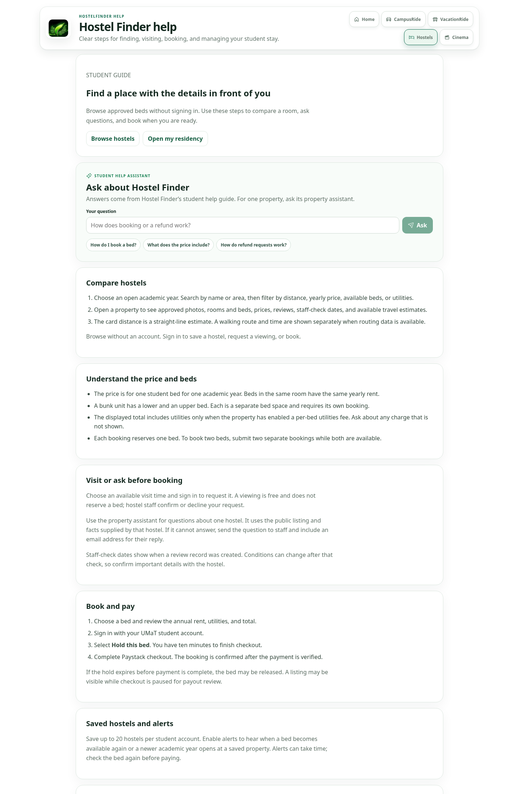
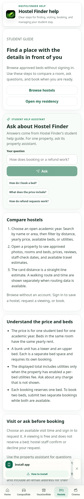

# Hostel Finder user guide

**Audience:** students, property owners, authorized hostel managers, moderators, and administrators
**Last reviewed against the application:** 29 September 2026
**Main student page:** `/hostel`
**Student help page and assistant:** `/hostel/help`
**Main hostel console:** `/console/hostels`
**Role-specific staff guide and assistant:** `/console/hostels/guide`

This guide describes the workflows currently present in the application. It distinguishes public-facing facts from staff-only operations and records current product limitations so help text does not promise features that are paused or not available.

## 1. What Hostel Finder does

Hostel Finder helps students discover approved accommodation near UMaT, compare individual bed spaces for an academic year, request a viewing, ask questions, and book online. After payment, a student can use the resident area to find their bed details, communicate with hostel staff, view announcements, and manage eligible service requests.

The service has separate review decisions for the owner account, identity, payout destination, property, photos, and each priced bed listing. A review in one area does not approve the others.

### Student help page captures

These are captures of the rendered public help page at desktop and phone widths.

## 2. Student guide

### Find and compare hostels

1. Open `/hostel`. You can browse without signing in.
2. Select an open academic year. Search by name or address and narrow the results by distance, maximum yearly price, minimum available beds, or utilities.
3. Sort by name, distance, or price. Use the map and property cards to compare options.
4. Open a property to see the approved photo gallery, rooms with available bed spaces, yearly prices, utilities, reviews, staff-check records, and travel information.
5. Save a property after signing in if you want to return to it or enable its availability/year alerts.

A price is for **one student bed for the selected academic year**, not the whole room. Where utilities are enabled, the displayed total includes the per-bed utilities amount recorded for the room. Ask the hostel about any charge that is not shown on the listing before paying.

A bunk unit has an upper and lower bed. Those are two separate student bed spaces, and each is booked individually. A room may contain up to six student bed spaces.

The distance shown on the hostel card is an approximate straight-line distance to the campus reference point. When a route is available, the property page separately shows an estimated pedestrian route and walking time to a selected campus destination. These figures are estimates; confirm the route and address before travelling.

### Request a viewing or ask a question

- Choose a published viewing time and sign in to request it. A viewing request is free and does not hold a bed. The landlord confirms or declines it.
- Use **Ask about this hostel** for a question answered from the property’s public listing and information provided by its staff.
- If the assistant cannot answer, use the follow-up form to send the question to hostel staff. Supply an email address where they can reply.
- A staff-check card shows the review date and record for supported details such as photos, location, utilities, and safety. A check is evidence of a review at that time; details can change afterward.

### Book a bed

1. Open an available bed and check the room, bed label, academic year, rent, utilities, and total.
2. Sign in with your UMaT student account if asked.
3. Select **Hold this bed**. The system reserves it for ten minutes while checkout is completed.
4. Complete payment at the Paystack checkout page. Return to the application after payment so the booking can be verified.

A bed is not booked just because checkout was opened. If the ten-minute hold expires before payment is completed, the bed may become available to another student. A property can appear publicly while booking is temporarily paused for payout review; the page will show that status.

### Saved hostels and alerts

Save a hostel for an academic year to keep it in your list. You may enable alerts for that saved property. The system can notify you when a bed becomes available again or when a newer academic year has approved beds. Availability may change before you act on an alert. Saved hostels are limited to 20 per student account.

### After payment

The residency page separates **Current stays** from **History**. Pending checkouts are visible; returning from checkout verifies payment. Use **Check payment** if it is delayed rather than starting another booking. One student can have one active booking or checkout for each academic year.

Choose **Overview**, **Requests**, **Messages**, or **Payments**. Paid describes payment only. Occupancy is recorded separately as Expected arrival, Checked in, Checked out, or No-show. Closed or past stays appear in History and no longer receive new private announcements or new services. Checkout does not automatically refund payment.

Open `/hostel/resident` using the same UMaT student account that paid for the booking. The resident view can show your confirmed bed, hostel contact, service information, messages, and announcements. It also provides eligible review and refund actions.

A review is tied to a paid stay and can be submitted once for that stay. The hostel may publish one reply; staff can hide a review with a recorded reason.

### Refund requests

Refund eligibility and the quoted amount depend on how many days remain before the academic year begins:

| Time before year begins | Policy amount |
| --- | ---: |
| 30 days or more | 100% |
| 7 to 29 days | 50% |
| Less than 7 days | 0% |

A refund request is reviewed by staff; submitting it does not mean it has been approved or paid. An administrator may change the policy amount only with a recorded reason. Once approved, the payment provider or a recorded manual transfer must settle the refund.

## 3. Owner and authorized manager guide

### Start or resume setup

Open [Set up your hostel](/console/hostels/onboarding). The three-step setup can be saved and resumed:

1. **Account and owner details:** confirm the legal contact and your relationship to the property. Submit this profile for its own review.
2. **Property:** enter the property name and address, search for a location suggestion, then confirm the map pin. State whether the property is independent or claim affiliation and provide an explanation/evidence. Add rooms and photos, then submit the property for review.
3. **Identity and payouts:** upload an identity document and ownership/authority evidence. Choose a bank or mobile money payout destination and submit it separately for review.

Use clear, current details. Location suggestions help place a pin; they do not count as staff verification. Uploaded identity evidence stays private to the owner and authorized staff. Staff review profile, identity, property, photos, and payout information as separate decisions.

**What each approval unlocks:**

- Identity approval unlocks listing and pricing work.
- Property approval is required before its beds can be submitted for listing review.
- Each bed listing requires its own staff decision before students can see it.
- Payout destination approval is required before students can book. A visible, approved bed can therefore display “Booking temporarily paused.”

### Add rooms and beds efficiently

A room is the physical room. Bed spaces are the individually bookable places inside it.

- Use **Create a room range** to apply a shared prefix, number range, capacity, bed layout, utilities fee, and amenities to repeated rooms.
- A range can contain up to 100 rooms. It is saved in atomic groups of 20, with progress and a continue action if a later group encounters a conflict.
- Choose separate beds or bunk beds. A bunk unit is created as two separately bookable spaces: lower and upper.
- The optional annual price is a **per-student-bed** price. All beds in the same room receive the same price for that year.
- Use **Price an existing room range** for rooms already present in the property.
- Use **Submit a room range** to send priced drafts for review together. The owner profile, identity, property, active academic year, available beds, and prices must pass the submission checks. Beds already pending or approved are skipped.
- Single room, per-room rate, and per-listing controls remain available for exceptions.

A failed group does not partially change that group. Earlier completed groups remain saved and can be resumed. If a room number already exists with different details, resolve it or choose another range before retrying.

Adding rooms after property approval can send the property back to draft for another property review. Check the property status before trying to submit the new bed listings.

### Photos, floor plans, and AI information

Upload property or room images in the property workspace. Accepted files are JPEG, PNG, or WebP, up to 6 MB each; the gallery is limited to 12 images per property. Photos and floor plans go through staff approval before they are shown publicly. Current room media supports photos and floor-plan images; video walkthrough uploads are not supported.

Use the **AI information** workspace to enter factual property and room notes that the public assistant may use. Keep those notes accurate, specific, and suitable for students. The assistant can also use public availability, prices, distance, and published reviews. It should route unanswered questions to staff; it cannot guarantee a bed or invent unpublished details.

### Viewings, residents, and services

The resident directory has property, academic-year, status, and text filters, with 20 results per page. Totals cover the selected property and year across every page. Desktop uses a table; mobile uses cards and a filter popup.

Open **View resident** for the detail panel. Set an arrival date within the booked year, check in the student, and record any issued key. Checkout and no-show release the bed while retaining the payment record; add a staff note. A no-show cannot be recorded before the arrival date. Transfers require an approved available bed in the same property and year with the same rent and utilities. Return any recorded key before checkout or transfer, and record the new key if issued. Each change records the staff member in residency activity. Refresh details if another member of staff has changed the record. Open refunds block occupancy actions until resolved.

- In the viewing desk, create visit slots, set their capacity, and confirm or decline requests.
- In Residents & Services, view resident-related activity, reply to booking messages, post announcements, and manage enabled resident services.
- Only offer services that the hostel can actually deliver and that have been reviewed with the platform’s current service policy.
- The owner can invite or revoke hostel managers. An active manager can use the day-to-day hostel workspace for the owner’s property. Manager invitation and payout-destination changes are owner-only. Never share the owner’s sign-in.

### Money and payouts

The student payment is collected through Paystack. The platform records a payout ledger entry, platform commission, and landlord net amount. Payout release is gated by payout approval and timing rules; the resident page and landlord statement show the relevant status. If a transfer fails or requires manual handling, contact platform support rather than asking the student to pay again.

## 4. Moderator and administrator guide

The console routes are role-gated. A moderator is not automatically an administrator.

### Moderators

The hostel listing workspace lets moderators review submitted listings, approve or reject them with a reason, and suspend listings when necessary. Moderators can also work the trust-signal queue and review public content where their role permits. Confirm the property and bed details against the evidence before deciding.

### Administrators

Administrators handle the wider operations surface, including:

- Owner profile, identity, payout, property, affiliation, and photo review queues.
- The academic-year catalogue and listing review.
- Reviews, refunds, and payout operations. Landlord managers handle their own viewing and resident workspaces.
- Hostel analytics and supply-risk signals.
- The service catalogue and platform controls.

Use the audit trail for decisions affecting identity, public visibility, payments, payouts, or refunds. Refund overrides require a reason. Payout-account details are masked by default; reveal actions are restricted and audited.

## 5. Status meanings

| Status | Meaning to the user |
| --- | --- |
| Draft | Saved privately and still being prepared |
| Pending review | Sent to staff; not public yet |
| Approved | Accepted for its review step; another step may still block booking |
| Suspended | Hidden or blocked by platform staff pending resolution |
| Booking paused | The bed is visible, but booking is blocked until payout checks are complete |
| Held | Temporarily reserved during the payment window |
| Paid / confirmed | Payment verified and the resident record created |
| Refund requested / approved / paid | Separate stages; “approved” does not mean the refund has settled |

## 6. System map and access

The service is composed of these user-facing areas:

| Area | Main route | What it covers |
| --- | --- | --- |
| Student discovery | `/hostel` | Search, filters, map, approved properties and saved-hostel actions |
| Property details | `/hostel/{propertyId}` | Beds, prices, photos, floor plans, views, staff checks, walking routes, assistant and reviews |
| Student residency | `/hostel/resident` | Confirmed stay, contact, messages, announcements, services, review and refund actions |
| Owner setup | `/console/hostels/onboarding` | Owner profile, property, identity, authority evidence and payout destination |
| Owner workspace | `/console/hostels` | Properties, rooms, bed spaces, annual rates, batch actions, photos, viewings and listing review status |
| Residents and services | `/console/hostels/residents` | Owner/manager resident operations and service requests |
| Platform review | `/console/hostels` | Admin/moderator bed listing review |
| Platform operations | `/console/hostels/reviews`, `/refunds`, `/payouts`, `/analytics`, `/signals`, `/plugins` | Role-gated trust, finance, metrics and catalogue tools |

At the data level, a property contains rooms; rooms contain physical bed spaces; each bed has a separate listing for an academic year; a paid booking creates the student's residency. Prices cross APIs as integer pesewas and are shown as Ghana cedis in the interface.

Public search and property pages use the approved listing gate. The platform stores operational records in Turso, private photo and identity objects in Cloudflare R2, and uses Paystack for student checkout and landlord transfers/refunds. Notifications and audit entries support changes across the workflow. Map tiles and pedestrian routing depend on external map/routing services.

| Role | Main hostel permissions |
| --- | --- |
| Student | Browse public information; sign in to save, request a viewing, book, message, review, request a refund, and manage residency |
| Landlord owner | Set up the account/property, submit details for review, manage beds/listings, residents, photos, viewings, AI facts, payout destination and manager access |
| Authorized hostel manager | Use the landlord's operational workspace for the linked property; cannot invite/revoke managers or change the owner's payout destination |
| Moderator | Review listings, eligible reviews and trust signals; does not receive administrator finance controls |
| Administrator | Manage the wider review, academic-year, payout, refund, analytics, signal and service-catalogue operations |

Console service assignment and page role checks both apply. A visible navigation link does not itself grant access; the server validates the signed-in role and, for managers, active membership under the landlord account.

## 7. Current limitations and product review

The core discovery-to-residency flow is implemented, with separate trust decisions and audit records. The main public and console surfaces have access checks and role-specific workspaces. Room range creation, bulk pricing, and bulk submission reduce repetitive listing setup.

The following items need care in product copy and operations:

1. **Hostel service add-ons:** the service catalogue, subscriptions, and resident requests exist, but the current product review has placed further plugin work on hold because the post-payment delivery/vendor and late-payment handling policies are unresolved. Do not describe every add-on as a guaranteed, actively supported fulfilment service until those decisions are closed. See [Service Plugins review](HOSTEL_FINDER_SERVICE_PLUGINS.md).
2. **Availability alerts:** alerts depend on background scans and the notification service. Do not promise an exact delivery time; advise students to recheck availability before paying.
3. **Walking routes:** route results depend on property coordinates, campus destinations, and routing-service availability. The straight-line distance is separate and should never be presented as a walking estimate.
4. **Verification freshness:** staff-check records prove that a check occurred on a date. They do not continuously monitor property conditions.
5. **Property approval and booking readiness:** these are different gates. A public listing is not a promise that checkout is currently enabled.
6. **Refunds:** the percentage is policy-based, but approval and settlement remain separate operations.
7. **Human response:** viewing confirmation, staff answers, listing decisions, payout exceptions, and refunds require staff action.

### Recommended next operational improvements

- Publish an escalation contact and response-time target for unanswered inquiries, viewing requests, and payout/refund exceptions.
- Show the last-updated date beside AI information and verification records, and prompt owners to re-confirm facts each academic year.
- Add an owner-side checklist that shows exactly which gate blocks booking: owner identity, property, bed listing, or payout account.
- Reconcile plugin vendor/payment policy before promoting add-ons.
- Monitor background availability scans and notification failures; show a neutral “check availability” message where a delivery cannot be guaranteed.

## 8. Quick links

- Student discovery: `/hostel`
- Student residency: `/hostel/resident`
- Owner setup: `/console/hostels/onboarding`
- Owner and moderator hostel workspace: `/console/hostels`
- Residents and services: `/console/hostels/residents`
- Reviews: `/console/hostels/reviews`
- Refunds: `/console/hostels/refunds`
- Payouts: `/console/hostels/payouts`
- Analytics: `/console/hostels/analytics`
- Trust signals: `/console/hostels/signals`
- Service catalogue: `/console/hostels/plugins`

Route access depends on the signed-in console role and assigned service permissions.

## Technical references

- [Public information copy](HOSTEL_FINDER_PUBLIC_INFORMATION.md)
- [Architecture](HOSTEL_FINDER_ARCHITECTURE.md)
- [API contract](HOSTEL_FINDER_API_CONTRACT.md)
- [Data flows](HOSTEL_FINDER_DATA_FLOWS.md)
- [Entity relationship diagram](HOSTEL_FINDER_ERD.md)
- [Landlord onboarding review](HOSTEL_FINDER_LANDLORD_ONBOARDING.md)
- [Moderation and trust](HOSTEL_FINDER_MODERATION_TRUST.md)

### Residency interface examples

These captures use fictional preview data; balances, names, and availability are illustrative.

- [Student residency on a phone](captures/residency-student-mobile.png): current/history views and the stay tabs.
- [Staff resident detail on desktop](captures/residency-staff-desktop.png): arrival details, occupancy actions, and the activity log.

Existing paid bookings begin in **Expected arrival** when this update is first applied. Staff should record actual arrivals; the migration does not assume that payment means the student has moved in.

### Maintenance requests (M1)

Available after deployment when enabled by the platform and property owner. Students open **My Hostel Residency → Requests → Report a problem**, review the details and follow replies, private photos and repairs in the report timeline. Staff use **Residents & Services → Maintenance** for the queue, assignment, updates and resolution. Owners configure property service hours and first-response targets. Existing reports continue after checkout or disabling new submissions.

See the [complete maintenance guide, operations notes and release status](HOSTEL_MAINTENANCE_M1.md). The public help page and role-specific AI guide include these procedures; the assistant cannot read or update live reports.

- [Mobile report form](captures/maintenance-report-mobile.png)
- [Mobile confirmation summary](captures/maintenance-review-mobile.png)
- [Desktop staff maintenance desk](captures/maintenance-staff-desktop.png)
- [Desktop report detail](captures/maintenance-detail-desktop.png)

These captures use fictional preview data. Physical iOS/Android testing and the property pilot remain pending.

### Room condition records (M2)

After deployment and enablement, students use **My Hostel Residency → Requests → Room condition** to record move-in observations, private photos and amendments. Staff use **Residents & Services → Condition records** to acknowledge receipt, request clarification and record checkout observations. Open disagreements remain visible and block closure; acknowledgment does not mean agreement. Transfers preserve earlier evidence and open a separate handover for the new assignment. No action creates a charge or refund.

See the [M2 guide, downloadable-summary instructions and screenshots](HOSTEL_CONDITIONS_M2.md). Local implementation is complete; deployment and pilot/device checks are pending.

## Stay plans: renewals and room changes (M3)

Students use **My Hostel Residency → Requests → Stay plans**. Request an equal-price move or a next-year renewal, review the staff offer and accept before expiry. Offers show the academic year, annual rent per student, utilities and total; they do not reserve inventory. Moves require staff key handover. Renewals use a separate verified ten-minute checkout and preserve the current stay. Changed quotes require fresh acceptance. Do not pay twice while verification is pending.

Owners configure property enablement and renewal windows from **Residents & Services → Stay plans → Request settings**. Platform enablement is also required. Price and obtain approval for next-year listings before offering them; current occupancy does not prevent a separate future-year listing. Managers review and fulfill within their hostel scope. Different-price moves remain unavailable.

See the [complete M3 guide, safeguards, rollout notes and page captures](HOSTEL_STAY_PLANS_M3.md). The public and staff help assistants explain these steps; they cannot view live requests, accept offers or take payments. M3.1–M3.2 use default-off platform and property switches; the property pilot and real-device verification remain pending.
